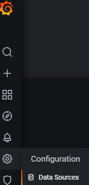
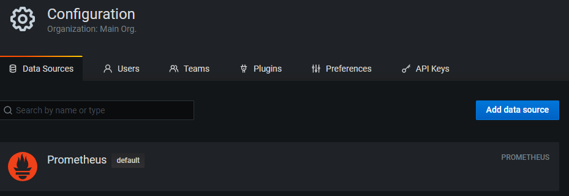
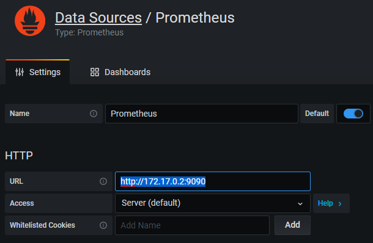
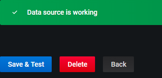
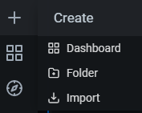
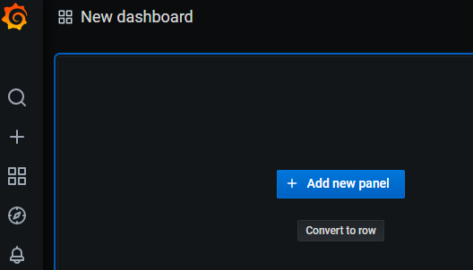
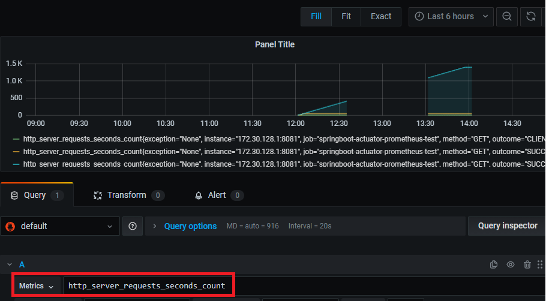
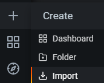
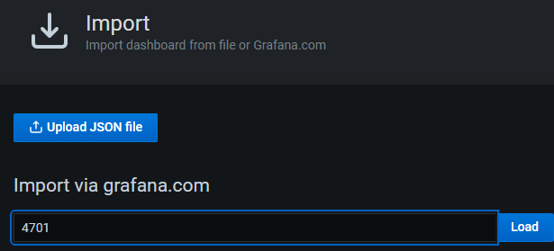
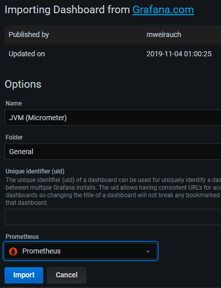

# Prometheus + Grafana

[TOC]

## 安裝

### 快速啟動
```sh
sudo ./start_prometheus_grafana_deploy.sh
```

### Prometheus 

創建prometheus.yml
```yaml
# my global config
global:
  scrape_interval:     15s  # Set the scrape interval to every 15 seconds. Default is every 1 minute.
  evaluation_interval: 15s  # Evaluate rules every 15 seconds. The default is every 1 minute.
# scrape_timeout is set to the global default (10s).
# Load rules once and periodically evaluate them according to the global 'evaluation_interval'.

rule_files:
# - "first_rules.yml"
# - "second_rules.yml"
# A scrape configuration containing exactly one endpoint to scrape:
# Here it's Prometheus itself.

scrape_configs:
  # The job name is added as a label `job=<job_name>` to any timeseries scraped from this config.
  - job_name: 'prometheus'
  # metrics_path defaults to '/metrics'
  # scheme defaults to 'http'.
    static_configs:
      - targets: ['localhost:9090']

  # demo job
  - job_name: 'springboot-actuator-prometheus-test' # job name
    metrics_path: '/actuator/prometheus' # 獲取測量用的uri路徑
    scrape_interval: 5s # 間隔
    static_configs:
      - targets: ['172.30.128.1:8081'] # 要監控的server ip
```

使用Docker建立

```shell
docker run \
    --name prometheus -d \
    -p 9090:9090 \
    -v ${PWD}/prometheus.yml:/etc/prometheus/prometheus.yml \
	-e TZ=Asia/Taipei \
    prom/prometheus
```

### Grafana

使用Docker建立

```shell
docker run \
    -d --name=grafana \
    -p 3000:3000 \
    -e TZ=Asia/Taipei \
    grafana/grafana 
```

### 使用docker-compose.yml建立Prometheus + Grafana

docker-compose.yml

```yaml
version: "3.9"

services:
  prometheus:
    image: prom/prometheus
    ports:
      - "9090:9090"
    volumes:
      # 綁定prometheus內部的資料
      - ${PWD}/prometheus-storage:/prometheus
      # 使用自訂的prometheus.yml
      - ${PWD}/prometheus.yml:/etc/prometheus/prometheus.yml
    user: "1000:1000" # 需要使用user id，可以透過echo $UID 取得
    environment:
      - TZ=Asia/Taipei # 設定時區
  grafana:
    image: grafana/grafana
    ports:
      - "3000:3000"
    volumes:
      # 記得在localhost端修改權限，否則無法使用 sudo chown -R 472:472 grafana-storage
      - ${PWD}/grafana-storage:/var/lib/grafana
    environment:
      - TZ=Asia/Taipei  # 設定時區
```

## 操作

### Prometheus 
TODO 待補...

### Grafana

#### 設定Prometheus

1. 點選左方列表 => 齒輪圖示 => Data Source



2. 選擇prometheus



3. 填寫表單
由於這邊是使用docker來建立，因此可以先查詢prometheus內部IP

```sh
❯ docker inspect prometheus | grep IPAddress
    "SecondaryIPAddresses": null,
    "IPAddress": "172.17.0.2",
    "IPAddress": "172.17.0.2",
```

將http位址: http://172.17.0.2:9090 填入到表單內



按下save and test，如果失敗則會報錯誤，成功如下。



####  創建Dashboard
1. 點擊左方的"+"符號，按下Dashboad



2. 按下Add new panel



3. 輸入Metrics中的PromQL(prometheus的查詢語句) http_server_requests_seconds_count ，即可查看結果



**補充**
如果不知道如何查看prometheus的查詢語句，可以透過springboot內的網址
```
http://localhost:8081/actuator/prometheus
```

這邊可以查看網址結果


#### Dashboard主題樣式

1. 主題樣式網址
```
https://grafana.com/grafana/dashboards
```

有推薦兩個主題
```
JVM (Micrometer)
https://grafana.com/grafana/dashboards/4701

Spring Boot Statistics
https://grafana.com/grafana/dashboards/6756
```

2. 更換主題樣式
這邊使用JVM (Micrometer)進行舉例。

點選Copy ID to Clipboard


或將網址最後面的 4701進行複製下來
```
https://grafana.com/grafana/dashboards/4701
```

點選左方的"+"號，並點選Import匯入



點選右方的Import


將4701貼上，並按下Load



Load完成後的畫面，點選Prometheus下拉式選單並點選prometheus，接著點擊Import。



### 使用PromQL查詢語句
TODO 待補...


## 參考
[參數檔很齊全](https://juejin.cn/post/6844903809517371406)


